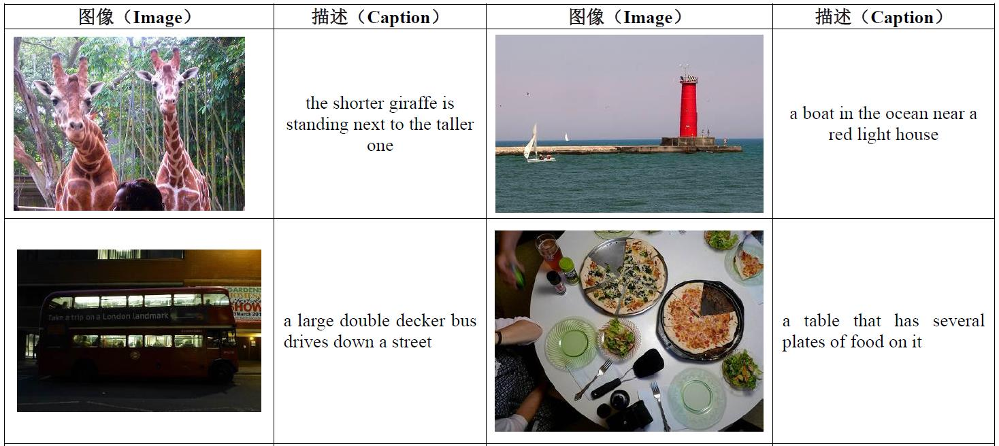
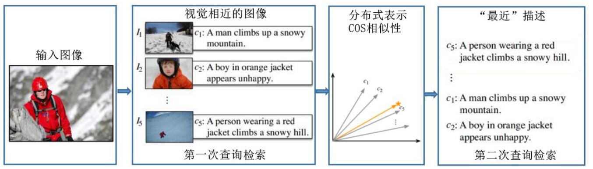
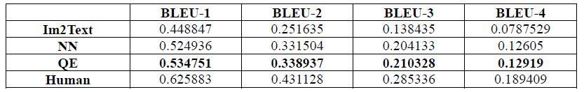
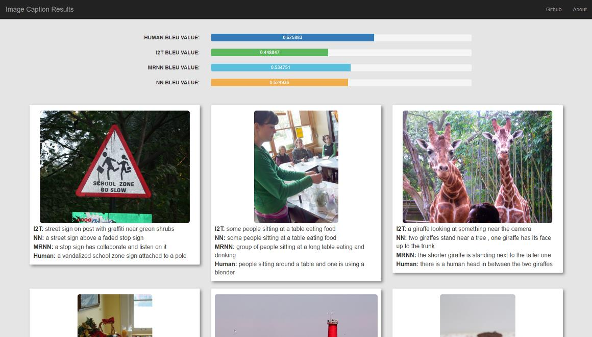

# Image Caption


Automatically generating describing information for images is a fundamental problem for artificial intelligence connected with computer vision and natural language processing. The research is with great practical significance, for instance, to help visually impaired people to have a better understanding of the content of the images on web. 

This project is the implementation of a  data driven approach, used to automatically generate English captions for given images. The core algorithm of this project is mainly implemented by C++, while the image features are extracted by Caffe and the sentence vectors are extracted by Word2Vec.




## Algorithm Details

This project implements a data driven query expansion approach. And it can be roughly desribed by the following three steps:

* It begins with **nearest neighbor algorithm**, which is to find a set of nearest images in the training set that contains images as well as related captions.
* **Sentence vectors** are extracted from the captions of the nearest images by employing Word2Vec, and then averaged to generate a sentence vector for the input image.
* The generated vector is later used to **rerank** the captions of the K nearest neighbors and finally the nearest caption is **borrowed** as the generated caption for the given image.

The main process is illustrated as follow:




## Auxiliary Module

This project also provide two auxiliary modules, which should be useful for some other similar image caption projects. They are both self-contained and can be used independently.

* **BLEU**: It is an algorithm for evaluating the quality of text which has been machine-translated from one natural language to another. Check out the subfolder `bleu/` for more details.
* **Webpage Autogenerator**: It is a tool that can be used to generate a beautiful webpage based on the given images, captions and BLEU scores. Check out the subfolder `result/` for more details.


## Results

### Quantized Data



### Presentation Webpage




## How to Run 

Run the following commands

```sh
bash setup.sh   # download some required files
bash run.sh     # compile the project
./demo          # auto generate captions, run BLEU test and generate presentation webpage.
```

After it all finishes, the final result should be presented in `result/index.html`


## References

1. V. Ordonez, G. Kulkarni, and T. Berg. Im2text: Describing images using 1 million captioned photographs. In NIPS, 2011. 1, 2, 3.
2. Devlin Jacob, Gupta Saurabh, Girshick Ross, Mitchell Margaret, and Zitnick C Lawrence. Exploring nearest neighbor approaches for image captioning. arXiv preprint arXiv:1505.04467, 2015b.
3. Mao Junhua, Xu Wei, Yang Yi, Wang Jiang, and Yuille Alan. Deep captioning with multimodal recurrent neural networks (m-RNN). arXiv:1412.6632 [cs.CV], 2014. 12.


